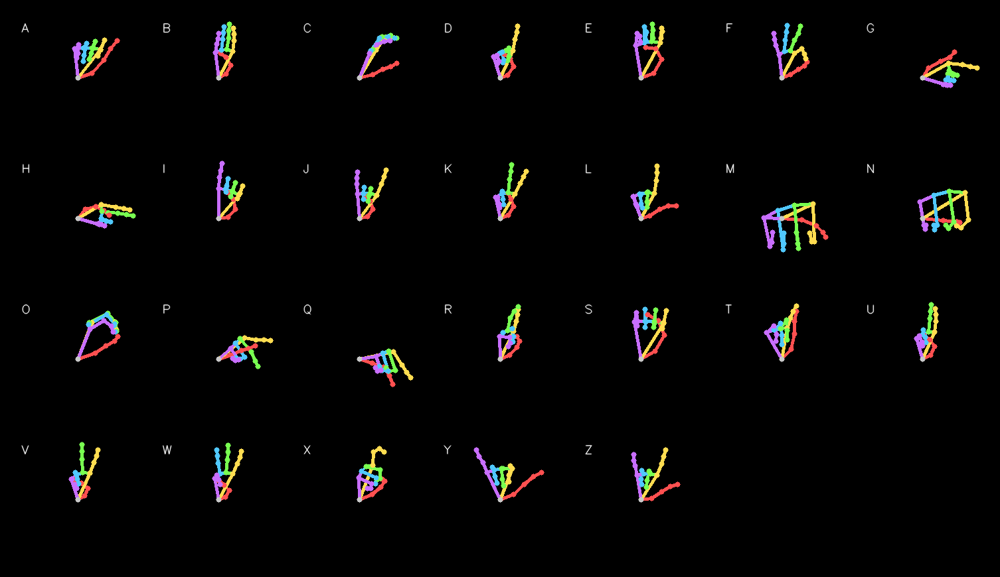

# GestureFlow

**Landmark-based hand gesture recognition.**

Real-time recognition of hand-sign letters from a webcam, assembled into words and
passed to a local LLM that turns them into a readable sentence. It runs as a web app
(Next.js + FastAPI + SQLite/PostgreSQL) or as a standalone desktop script.

The classifier does **not** look at camera pixels. Every frame is reduced to 21 hand
landmarks, normalized into a canonical pose, and redrawn as a clean skeleton on a black
canvas. A custom PyTorch CNN classifies that skeleton. Background, lighting, clothing and
skin tone never reach the model.

---

## ✨ Features

- **Landmark-based recognition** — MediaPipe (via cvzone) extracts 21 hand landmarks per frame
- **Background-free input** — the CNN sees a rendered skeleton, not the camera image
- **Custom PyTorch CNN** — 586,234 parameters, trained from scratch on this repository's own data
- **Pose normalization** — hand position and distance from camera are removed before classification
- **Landmark-space augmentation** — rotation, scale, perspective and joint noise applied to the coordinates, not to pixels
- **Confidence gating and temporal smoothing** — majority vote over recent frames plus a stability counter before a letter is committed
- **Sentence generation** — committed letters are sent to a local Ollama model for grammatical correction
- **Leakage-free evaluation** — a whole recording session is held out as the test set, and a leakage detector refuses to train if any session sits on both sides
- **Confusion-aware data collection** — the collector ranks letters by how badly they fail on an unseen session and tells you what to record next; every sample is written to disk immediately
- **Dataset inspection tool** — renders the mean skeleton per class and reports per-class consistency
- **Train/inference config guard** — the checkpoint stores the preprocessing settings and refuses to load if they have changed
- **Golden-vector tests** — preprocessing output and model predictions are pinned byte for byte, so a refactor cannot silently change what the model sees
- **Web app** — Next.js frontend with in-browser hand tracking; only landmarks travel to the server, over a WebSocket
- **FastAPI backend** — versioned REST API, live WebSocket recognition, JWT login with Argon2-hashed passwords, login rate limit
- **Database with migrations** — SQLAlchemy + Alembic; SQLite locally (zero setup), PostgreSQL in Docker; camera frames and landmark coordinates are never stored
- **Edge mode** — the model also runs inside the browser (ONNX Runtime Web), so nothing leaves the device; it gives the same letter as the server on 99.90% of samples
- **Personal calibration** — sign each letter a few times once and recognition adapts to your hand; on an unseen session it raised accuracy from 92.7% to 97.3%
- **Analytics dashboard** — your letters per day and most-signed letters, over 7, 30 or 90 days
- **Text-to-speech** — a Speak button reads the text or the generated sentence aloud
- **Measured latency** — 29 ms median server time per frame on CPU, from a benchmark script in the repo
- **Docker Compose** — database, API and web app in one command
- **Try without an account** — Edge mode at `/try`: nothing sent, nothing stored
- **Your data, your call** — a privacy page, and account deletion that removes everything stored for you
- **Deploy-ready** — sentence model switchable between local Ollama and hosted Groq, per-user sentence limit, PostgreSQL URLs from Neon/Supabase accepted as-is, automatic API deploys to a Hugging Face Space
- **CI** — GitHub Actions runs lint, 180+ Python tests (SQLite and PostgreSQL), the Edge parity check, the frontend build and the Docker build on every push

---

## 🎯 Project Overview

**The problem.** Pixel-based gesture classifiers learn the room as much as the gesture. Move
the camera, change the lamp, or wear a different shirt, and accuracy collapses.

**The approach.** MediaPipe already solves hand detection. This project uses only its output:
21 `(x, y)` joint positions. Those are translated so the wrist sits at the origin and scaled so
the furthest joint sits at distance 1, which removes where the hand was and how far away it was.
The result is drawn as a 128×128 colour skeleton and handed to a CNN.

Because the nuisance variation is removed arithmetically rather than learned, the model needs far
less data than a pixel classifier would.

**Sentence generation.** Recognized letters accumulate into a list. On exit, that list goes to a
local Ollama model through LangChain, which is prompted to produce a grammatically correct
sentence from the unpunctuated sequence.

---

## 🤟 Supported Hand Gestures

The model is trained on 26 classes, `A` through `Z`. Each class is one static hand shape, captured
from the author's own hand.

The image below is generated by `gestureflow/preview.py` directly from `data/landmarks.csv`. Each tile is the
**mean shape** of that class: every sample of that letter is normalized, the landmark coordinates
are averaged, and one skeleton is drawn from the average. It is the authoritative reference for
what each class looks like to the model.



Colours identify fingers: grey wrist, red thumb, orange index, green middle, blue ring, magenta pinky.

### Class table

`spread` is the average distance of a sample from its class mean — higher means the gesture was
held less consistently during capture. `session gap` is the distance between the `day1` mean shape
and the `day2` mean shape. Both are printed by `gestureflow/preview.py`.

| Class | Samples | Spread | Session gap |
| ----- | ------- | ------ | ----------- |
| A     | 115     | 0.1162 | 0.0880      |
| B     | 110     | 0.0640 | 0.0254      |
| C     | 114     | 0.0880 | 0.0916      |
| D     | 118     | 0.0738 | 0.0927      |
| E     | 116     | 0.0925 | 0.0549      |
| F     | 113     | 0.0687 | 0.0516      |
| G     | 113     | 0.0483 | 0.0472      |
| H     | 117     | 0.0488 | 0.0475      |
| I     | 110     | 0.0617 | 0.0360      |
| J     | 113     | 0.0650 | 0.0450      |
| K     | 121     | 0.0660 | 0.0783      |
| L     | 114     | 0.0509 | 0.0401      |
| M     | 112     | 0.2592 | 0.1717      |
| N     | 119     | 0.2286 | 0.0952      |
| O     | 114     | 0.1060 | 0.0350      |
| P     | 122     | 0.0750 | 0.0494      |
| Q     | 112     | 0.0926 | 0.0589      |
| R     | 113     | 0.0687 | 0.0558      |
| S     | 107     | 0.1023 | 0.1126      |
| T     | 113     | 0.0675 | 0.0632      |
| U     | 111     | 0.0443 | 0.0220      |
| V     | 112     | 0.0498 | 0.0232      |
| W     | 107     | 0.0612 | 0.0187      |
| X     | 116     | 0.0833 | 0.0719      |
| Y     | 108     | 0.0628 | 0.0620      |
| Z     | 108     | 0.0418 | 0.0351      |

**Total: 2,948 samples across 26 classes, captured in two sessions (`day1`, `day2`).**

M and N have roughly four times the spread of the steadiest classes. Both are held well off
vertical with the thumb tucked under the fingers, which is where MediaPipe's landmark placement
becomes least stable.

---

## 🌐 Web App

```text
Browser                                   Server                         Database
───────                                   ──────                         ────────
webcam ─▶ MediaPipe (in the page) ─▶ 21 landmarks ─WebSocket─▶ FastAPI ─▶ RecognitionSession ─▶ committed letters
                                                                   │      (gestureflow.core)
          live letter, confidence, hold progress, top-3 ◀──────────┘
```

**Privacy.** The browser never uploads video. It runs MediaPipe itself, from files the app
serves, and sends only 42 numbers per frame. The server stores the letters you commit, not
the frame stream, and no landmark coordinates.

**Measured, not claimed.** `python -m backend.bench_ws` streams real landmarks to a running
server. On the development machine (CPU only), the median server time per frame was 29.1 ms
(p95 33.0 ms) and the median round trip 31.8 ms. See [`docs/API.md`](docs/API.md) for the
endpoints, the WebSocket protocol and the security model.

**Two modes.** Switch on the Recognize page:

| Mode | What runs where | What leaves your device |
| --- | --- | --- |
| Server | Hand tracking in the browser, the model on the server | 21 landmarks per frame |
| Edge | Both in the browser (MediaPipe + ONNX Runtime Web) | Nothing. No session is saved either |

The browser can't run OpenCV, so Edge mode draws the skeleton with a simpler rasterizer.
Rather than assume that's harmless, `python -m gestureflow.edge` measures it: the same letter
as the server on **2,945 of 2,948 samples (99.90%)** (`docs/edge_parity.json`). The TypeScript
version is checked to be pixel-identical to the Python reference on every sample
(`pnpm test:edge`).

**Calibration.** On `/calibration` you sign each letter for about half a second. The server
keeps an average of the model's features per letter (not your landmarks) and blends
similarity to them into every prediction. With a model that never saw the test session,
5 frames per letter took accuracy from **92.7% to 97.3%**, the weakest letter, K, from F1
**0.14 to 0.96**, and the share of frames confident enough to commit a letter from **25% to
79%**, with none of the wrong guesses confident enough to commit (`docs/calibration_report.json`). Those calibration frames came from the same
sitting as the test frames: that's how calibration is used, but it's the favourable case.

---

## 🏗️ System Architecture

```text
Webcam (cv2.VideoCapture)
   ↓
cvzone HandDetector (MediaPipe hand_landmarker)   findHands(frame, draw=False)
   ↓
21 landmarks in pixel coordinates                 hands[0]["lmList"]
   ↓
preprocessing.normalize()  wrist → origin, scale by furthest joint
   ↓
preprocessing.render()     128 × 128 × 3 colour skeleton on black
   ↓
SkeletonCNN (PyTorch)      4 conv blocks → global average pool → linear
   ↓
softmax → (label, confidence)
   ↓
temporal smoothing         majority vote over last 7 frames
   ↓
stability gate             confidence > 0.90 for 15 consecutive frames
   ↓
letter appended to sentence list
   ↓
Ollama (gemma3:4b) via LangChain
   ↓
Grammatical sentence
```

The path from landmarks to skeleton is identical in training and inference — both import the
same `gestureflow/core/preprocessing.py`. That is the point of keeping it in one module, and
`tests/test_golden.py` pins its output byte for byte.

---

## 🔄 How It Works

**1. Camera input.** `cv2.VideoCapture(0)` in `gestureflow/live.py`.

**2. Hand detection.** `HandDetector(maxHands=1)` from cvzone wraps MediaPipe's hand landmarker.
It is called with `draw=False` so the landmarks come from an unmodified frame; the on-screen
drawing happens on a separate copy. This matters — drawing onto the frame you then analyse
corrupts the input.

**3. Normalization** (`preprocessing.normalize`). The wrist (landmark 0) is subtracted from all 21
points, then everything is divided by the largest distance from the origin. Position and scale
stop existing as variables.

Rotation alignment is available but **disabled** (`ALIGN_ROTATION = False`). In this gesture set
orientation carries meaning — several classes are held 45–78° off vertical — so aligning every
hand upright would merge distinct classes.

**4. Rendering** (`preprocessing.render`). The normalized points are mapped onto a 128×128 canvas with
a 12% margin. The 21 bones from `CONNECTIONS` are drawn as lines, then the joints as filled
circles on top. Each finger gets its own colour so the network can distinguish overlapping fingers
in a flat 2D drawing.

**5. Classification** (`GesturePredictor.predict` in `gestureflow/core/inference.py`). The image is transposed to
`(1, 3, 128, 128)`, scaled to 0–1, and passed through the network. Softmax gives the confidence.

**6. Confidence filtering.** Below `CONF_SHOW = 0.70` nothing is displayed.

**7. Smoothing and accumulation** (`LetterCommitter` in `gestureflow/core/temporal.py`). Recent predictions go into a 7-frame deque and the majority wins,
which removes single-frame flicker. A letter is appended only after `COMMIT_FRAMES = 15` consecutive
frames above `CONF_COMMIT = 0.90`. A green flash confirms the commit.

**8. Sentence generation** (`generate_sentence`). The letter list is passed through a LangChain
chain — `PromptTemplate | OllamaLLM | StrOutputParser` — using `gemma3:4b`.

---

## 🧠 Machine Learning Model

**Framework:** PyTorch.

**Input:** `(3, 128, 128)` float tensor in 0–1 — a rendered skeleton, not a photograph.

**Output:** 26 logits, one per class.

**Architecture** (`SkeletonCNN` in `gestureflow/core/model.py`):

```text
conv_block(3,   32)    128 → 64
conv_block(32,  64)     64 → 32
conv_block(64, 128)     32 → 16
conv_block(128,128)     16 → 8
AdaptiveAvgPool2d(1) → Flatten → Dropout(0.3) → Linear(128, 26)
```

Each `conv_block` is `Conv2d(3×3, padding=1, bias=False) → BatchNorm2d → ReLU`, twice, then
`MaxPool2d(2)`. Convolution biases are omitted because the BatchNorm shift that follows makes them
redundant.

**Parameter count:** 586,234 for 26 classes. Printed at the start of every training run.

**Training setup** (`gestureflow/train.py` defaults):

| Setting    | Value                                    |
| ---------- | ---------------------------------------- |
| Optimizer  | Adam, `lr=1e-3`, `weight_decay=1e-4`     |
| Schedule   | `CosineAnnealingLR(T_max=epochs)`        |
| Loss       | `CrossEntropyLoss(label_smoothing=0.05)` |
| Batch size | 64                                       |
| Epochs     | 40                                       |
| Checkpoint | best validation accuracy, not last epoch |

**Augmentation** (`preprocessing.augment`) runs in landmark space, before rendering, on training samples
only: rotation ±15°, uniform scale 0.85–1.15, per-axis scale 0.92–1.08, per-joint Gaussian noise
(σ = 0.015), translation ±0.05. There is deliberately no horizontal flip — mirroring a hand changes
its chirality.

**Split** (`make_split` in `gestureflow/train.py`, built on `gestureflow/splits.py`). The most recent capture
session is held out **entirely** as the test set. Validation is the last 15% of each class within
the remaining sessions and is used only to pick the checkpoint. A leakage check runs before
training and stops it if a session appears in both train and test.

This replaced an earlier split that took the tail of each class across sessions. Frames from one
sitting are near-duplicates (burst capture saves every 3rd frame), and that split put `day2` in
validation, test **and** 27% of training, which inflated the test number.

**Checkpoint contents** (`models/gesture_cnn.pt`): `state_dict`, `labels`, and `handnorm_config` holding
`canvas`, `margin` and `align_rotation`. `GesturePredictor` compares that config against the live
preprocessing settings at load and refuses to start if they differ, so editing preprocessing
without retraining fails loudly instead of silently degrading predictions.

### Measured accuracy

Train on `day1`, test on `day2`, a session the model never saw. Produced by
`python -m gestureflow.evaluate --hold-out day2 --epochs 25` and stored in
[`docs/evaluation_report.json`](docs/evaluation_report.json):

| Protocol | Accuracy | Macro F1 |
| --- | --- | --- |
| Old split, `day2` on both sides (leaky) | 0.9758 | 0.9744 |
| **Unseen session** | **0.9417** | **0.9343** |

Weakest letters on the unseen session (F1): **K 0.16**, V 0.69, N 0.70, M 0.86. Every other
letter is at 0.95 or above. K is mostly misread as V, so K, V, N and M are the letters to
re-record. The gap is data, not model capacity: training accuracy reaches 98% in the same run.
The leaky figure and the full breakdown are in [`docs/EVALUATION.md`](docs/EVALUATION.md).
Results vary by about half a point between runs.

---

## 📁 Project Structure

```text
Hand_Recognition/
├── gestureflow/                 all the code
│   ├── live.py                  ▶ webcam recognition + Ollama sentence generation
│   ├── collect.py               ▶ record landmarks, prioritised by what the model gets wrong
│   ├── train.py                 ▶ train the CNN
│   ├── evaluate.py              ▶ accuracy on a session the model never saw
│   ├── preview.py               ▶ mean skeleton per letter → docs/images/preview_mean.png
│   ├── core/                    camera-free logic shared by all of the above
│   │   ├── preprocessing.py     normalize + render + augment  (single source of truth)
│   │   ├── model.py             SkeletonCNN
│   │   ├── inference.py         checkpoint loading + single-frame prediction
│   │   ├── temporal.py          smoothing + letter commits
│   │   ├── calibration.py       per-user prototypes blended into predictions
│   │   └── session.py           one recognition stream: landmarks in, result out
│   ├── export_onnx.py           ▶ export the CNN for Edge mode → models/gesture_cnn.onnx
│   ├── edge.py                  ▶ Edge-mode renderer reference + Edge vs Server parity
│   ├── calibration_eval.py      ▶ measure what calibration does for an unseen session
│   ├── sentence.py              letters → sentence via local Ollama
│   ├── splits.py                group-aware splits + leakage detector
│   ├── detector.py              cvzone hand detector, model stored in models/
│   └── paths.py                 every file location in one place
│
├── backend/                     FastAPI service (see docs/API.md)
│   ├── main.py                  app factory, /api/v1 routes
│   ├── api/                     auth, recognition, gestures, sessions, calibration, analytics, ws
│   ├── models.py                4 tables: users, sessions, committed letters, calibration
│   ├── migrations/              Alembic migrations (`alembic upgrade head`)
│   ├── security.py, deps.py     password hashing, JWT, login rate limit
│   └── bench_ws.py              ▶ measure WebSocket latency
├── frontend/                    Next.js web app (see frontend/README.md)
├── docker/                      Dockerfiles for the API and the web app
├── docker-compose.yml           PostgreSQL + API + web app
├── .github/workflows/ci.yml     lint, tests, builds on every push
├── alembic.ini                  migration settings
│
├── data/
│   └── landmarks.csv            dataset: 2,948 rows × 46 columns
├── models/
│   ├── gesture_cnn.pt           trained weights + labels + preprocessing config
│   ├── gesture_cnn.onnx/.json   the same model for the browser (Edge mode)
│   └── hand_landmarker.task     MediaPipe model, downloaded on first run (not in git)
├── docs/
│   ├── API.md                   endpoints, WebSocket protocol, latency, security
│   ├── DEPLOY.md                putting it online (Neon, Groq, Hugging Face, Vercel)
│   ├── EVALUATION.md            the train/test leak and how it was measured
│   ├── evaluation_report.json   per-letter results, read by the collector
│   ├── calibration_report.json  what calibration does, measured
│   ├── edge_parity.json         Edge vs Server mode agreement, measured
│   └── images/preview_mean.png  gesture reference image
├── tests/                       pytest suite, incl. golden vectors in tests/golden/
│
├── requirements.txt             every package at an exact version (generated from uv.lock)
├── pyproject.toml               direct dependencies and their allowed ranges
├── uv.lock                      resolved lockfile
├── .python-version              3.12
├── .gitignore
└── README.md
```

**`gestureflow/core/preprocessing.py` is imported by training, inference, the collector and
the preview.** Changing it changes what every part of the system sees, which is why the
checkpoint records its settings and `tests/test_golden.py` pins its output.

### Dataset format

`data/landmarks.csv` has 46 columns:

| Column              | Meaning                           |
| ------------------- | --------------------------------- |
| `label`             | Class, `A`–`Z`                    |
| `session`           | Capture session name, e.g. `day1` |
| `timestamp`         | Unix time of capture              |
| `seq`               | Index within the run              |
| `x0, y0 … x20, y20` | 21 landmarks in pixel coordinates |

Landmarks are stored **raw**. Normalization happens at load time, so changing preprocessing and
retraining requires no recollection.

---

## 🛠️ Tech Stack

| Technology                                       | Purpose                                         |
| ------------------------------------------------ | ----------------------------------------------- |
| Python                                           | Implementation language                         |
| OpenCV (`opencv-python`)                         | Camera capture, drawing, image I/O              |
| MediaPipe                                        | Hand landmark detection                         |
| cvzone                                           | Wrapper over MediaPipe's hand landmarker        |
| PyTorch                                          | CNN definition, training and inference          |
| NumPy                                            | Landmark maths — normalization and augmentation |
| pandas                                           | Dataset loading and splitting                   |
| scikit-learn                                     | Confusion matrix during evaluation              |
| LangChain (`langchain-ollama`, `langchain-core`) | Prompt chain to the local LLM                   |
| Ollama                                           | Local LLM runtime (`gemma3:4b`)                 |
| python-dotenv                                    | Loads `.env`                                    |
| FastAPI, Pydantic, Uvicorn                       | REST API and WebSocket                          |
| SQLAlchemy, Alembic, SQLite / PostgreSQL         | Persistence and migrations                      |
| PyJWT, argon2-cffi                               | Login tokens and password hashing               |
| Next.js 16, TypeScript, Tailwind CSS, shadcn/ui  | Web frontend                                    |
| MediaPipe Tasks (JavaScript)                     | Hand tracking in the browser                    |
| Docker Compose                                   | Running the whole stack                         |

---

## ⚙️ Installation

### 1. Clone

```bash
git clone https://github.com/AtharvaM25/Hand_Recognition.git
cd Hand_Recognition
```

### 2. Python version

**Python 3.12** is required. `.python-version` and `pyproject.toml` both pin it, and every version
in `requirements.txt` was resolved for it. MediaPipe wheels lag new Python releases, so 3.13 is
not supported yet.

### 3. Install

**With uv (recommended)** — creates `.venv` and installs the exact locked versions:

```bash
uv sync
```

**With pip:**

```powershell
py -3.12 -m venv .venv
.\.venv\Scripts\Activate.ps1
python -m pip install -r requirements.txt
```

On macOS / Linux use `python3.12 -m venv .venv` and `source .venv/bin/activate`.

`requirements.txt` pins every package, including indirect ones, to one exact version. It is
generated from `uv.lock`, so pip and uv install the same tree. Two pins prevent known clashes:
`opencv-python` and `opencv-contrib-python` (pulled in by MediaPipe) both provide `cv2` and are held
at the same version, and MediaPipe is kept on 0.10.x, the line cvzone 2.x is built on. To change a
dependency, edit `pyproject.toml`, then:

```bash
uv lock
```

```bash
uv export --no-hashes --no-dev --no-emit-project --no-header -o requirements.txt
```

Re-add the comment header at the top of `requirements.txt` after exporting.

On first run, cvzone downloads `hand_landmarker.task` (about 7.8 MB) into `models/`
automatically. No manual step is needed, but the first launch requires an internet connection.

---

## 🤖 Ollama Setup

Sentence generation requires a local Ollama server. Recognition itself works without it — only the
final step needs the LLM.

**1. Install Ollama** from [ollama.com](https://ollama.com).

**2. Pull the model used by the code:**

```bash
ollama pull gemma3:4b
```

The model name is set in `gestureflow/sentence.py` (`DEFAULT_MODEL = "gemma3:4b"`). The API
reads `GESTUREFLOW_OLLAMA_MODEL` and `GESTUREFLOW_OLLAMA_URL` instead.

**3. Make sure the server is running.** Ollama listens on `http://localhost:11434` by default, and
`langchain-ollama` connects there without configuration.

`gestureflow/live.py` calls `load_dotenv()`, so a `.env` file is read if present. No environment variable is
required for the default local setup.

---

## 🚀 Running the Project

Run every program from the project folder (with `.venv` activated, or prefix with `uv run`).

### Deploying it online

[`docs/DEPLOY.md`](docs/DEPLOY.md) walks through putting it on the internet for free:
- **Neon** for PostgreSQL
- **Groq** for sentence generation
- a free **Hugging Face Space** (Gradio SDK) for the API, deployed automatically from GitHub
- **Vercel** for the web app

Online, sentences come from Groq instead of the Ollama on your PC. Only the letters are sent.

### Web app with Docker

```bash
GESTUREFLOW_JWT_SECRET=change-me-to-a-long-random-string docker compose up --build
```

Then open http://localhost:3000. Compose starts PostgreSQL, runs the migrations, and serves
the API on port 8000 and the web app on port 3000.

### Web app without Docker

No database to install: it uses a SQLite file, `data/gestureflow.db`. Run every command from
the **project folder** (the one with `alembic.ini`), not from `frontend/`.

**Once**, create the tables. Re-run this after pulling changes that add a migration:

```powershell
uv run alembic upgrade head
```

**Terminal 1**, the API (http://localhost:8000 opens its docs):

```powershell
uv run uvicorn backend.main:app --reload
```

**Terminal 2**, the web app. Run these one at a time; Windows PowerShell 5.1 doesn't
support `&&`:

```powershell
cd frontend
```

```powershell
pnpm install
```

```powershell
pnpm dev
```

Then open http://localhost:3000. All settings are optional; see
[`.env.example`](.env.example).

### Desktop script

**Live recognition** — the main application:

```bash
python -m gestureflow.live
```

It loads `models/gesture_cnn.pt`, opens the webcam, and shows two windows: the camera feed with the
predicted letter and the accumulated sentence, and a `skeleton` window showing exactly what the CNN
sees. On quit, the collected letters are sent to Ollama and the generated sentence is printed.

**Inspect the dataset:**

```bash
python -m gestureflow.preview
```

Writes `docs/images/preview_mean.png` and prints per-class sample counts, spread and session gap.

**Run the tests:**

```bash
uv run pytest
```

The API tests use temporary SQLite files and run the real migrations. To also run them
against PostgreSQL, set `GESTUREFLOW_TEST_PG_URL` to an empty, disposable database.

From `frontend/`:

```powershell
pnpm lint; pnpm typecheck; pnpm test:edge; pnpm build
```

`pnpm test:edge` checks the browser's Edge-mode code against the Python reference: the renderer
on all 2,948 samples, the letter-commit logic on recorded streams, and the full pipeline through
ONNX Runtime Web.

---

## 📸 Data Collection and Training

### Collecting

Start by asking the collector what to record. It reads `docs/evaluation_report.json` and ranks
letters by unseen-session F1, then landmark spread, then how many sessions they appear in. No
camera is needed for this step:

```bash
python -m gestureflow.collect --plan
```

Then record, either one letter or the whole queue in priority order:

```bash
python -m gestureflow.collect --label K --session day3
```

```bash
python -m gestureflow.collect --auto --session day3
```

Keys: `s` saves one frame, `c` toggles burst capture, `q` finishes the letter. Every sample is
appended to `data/landmarks.csv` and flushed to disk at once, so closing the window or pressing Ctrl-C
loses nothing.

Re-run `python -m gestureflow.evaluate` after a recording session so the plan reflects the new
data.

| Argument    | Default                                  | Meaning                               |
| ----------- | ---------------------------------------- | ------------------------------------- |
| `--plan`    | —                                        | Print what to record, then exit       |
| `--label`   | —                                        | Record this one letter                |
| `--auto`    | —                                        | Record every flagged letter in order  |
| `--session` | —                                        | Name for this sitting                 |
| `--target`  | `150`                                    | Samples per letter to aim for         |
| `--csv`     | `data/landmarks.csv`                     | Output file                           |
| `--report`  | `docs/evaluation_report.json`            | Per-letter results used for the plan  |

Record every letter in each new sitting, with extra time on the weak ones. If a sitting contains
only a few letters, the model can learn "these conditions mean one of those letters".

Give each sitting a different `--session` name and change the conditions between them (lighting,
distance, time of day). The dataset currently holds `day1` and `day2`.

Only landmarks are saved. No images are written, so no background is ever stored.

### Training

```bash
python -m gestureflow.train --epochs 40
```

By default the most recent session is held out, so the printed `TEST accuracy` is measured on a
sitting the model never saw. Once you have that number, train the model you actually use on every
session:

```bash
python -m gestureflow.train --epochs 40 --test-session none
```

| Argument         | Default                                       |
| ---------------- | --------------------------------------------- |
| `--csv`          | `data/landmarks.csv`                          |
| `--out`          | `models/gesture_cnn.pt`                       |
| `--epochs`       | `40`                                          |
| `--batch-size`   | `64`                                          |
| `--lr`           | `1e-3`                                        |
| `--test-session` | most recent session; `none` holds nothing out |

Classes are read from the CSV's `label` column, so adding a new gesture needs no code change —
collect it under a new label and retrain. The checkpoint is overwritten whenever validation accuracy
improves, and `gestureflow/live.py` picks it up on the next launch.

---

## 🎮 Controls

**`gestureflow/collect.py`**

| Key | Function                                       |
| --- | ---------------------------------------------- |
| `s` | Save one frame                                 |
| `c` | Toggle burst capture (saves every 3rd frame)   |
| `q` | Finish this letter (`--auto` moves to the next) |

**`gestureflow/live.py`**

| Key | Function                                     |
| --- | -------------------------------------------- |
| `q` | Quit and generate the sentence               |
| `b` | Backspace — remove the last committed letter |

The OpenCV window must have focus for keys to register.

---

## 🔧 Configuration

**`gestureflow/core/preprocessing.py`** — changing any of these requires retraining;
`gestureflow/live.py` will refuse to load an older checkpoint, and `tests/test_golden.py` will fail
until you regenerate it with `python -m tests.golden.regenerate`.

| Constant         | Default | Meaning                                                                        |
| ---------------- | ------- | ------------------------------------------------------------------------------ |
| `CANVAS`         | `128`   | Rendered image size                                                            |
| `MARGIN`         | `0.12`  | Fraction of canvas left empty at the edges                                     |
| `BONE`           | `2`     | Bone line thickness                                                            |
| `JOINT`          | `3`     | Joint circle radius                                                            |
| `ALIGN_ROTATION` | `False` | Rotate every hand upright. Off, because orientation distinguishes classes here |

**`gestureflow/core/temporal.py`**

| Constant        | Default | Meaning                                               |
| --------------- | ------- | ----------------------------------------------------- |
| `CONF_SHOW`     | `0.70`  | Minimum confidence to display a prediction            |
| `CONF_COMMIT`   | `0.90`  | Minimum confidence to count toward a committed letter |
| `COMMIT_FRAMES` | `15`    | Consecutive stable frames before committing           |
| `SMOOTH`        | `7`     | Frames in the majority-vote window                    |

**`gestureflow/paths.py`** — where the dataset, models, report and preview image live.

**`gestureflow/collect.py`**: `BURST_EVERY = 3`, save one frame in this many during burst.

Camera index is `0` in both `cv2.VideoCapture(0)` calls.

---

## 🐛 Troubleshooting

**Camera not detected.** `cv2.VideoCapture(0)` fails if another application holds the webcam. Close
Zoom, Teams or your browser. Try index `1` if you have multiple cameras.

**`models/gesture_cnn.pt` not found.** Run `python -m gestureflow.train` to train one.

**`ERROR: preprocessing changed since training.`** Working as designed. You edited `CANVAS`,
`MARGIN` or `ALIGN_ROTATION` after training. Either revert the change or retrain.

**Ollama connection refused.** The server is not running or the model is not pulled. Check with
`ollama list` and confirm `gemma3:4b` is present. Recognition works without Ollama; only the final
sentence step fails.

**MediaPipe install failure.** Almost always a Python version problem. Use 3.12.

**First run hangs briefly.** cvzone is downloading `models/hand_landmarker.task`. Requires internet.

**Keyboard does nothing.** The OpenCV window needs focus. Click it before pressing keys.

**Low confidence or wrong letters.** Check the `skeleton` window first. A mangled skeleton is a
detection problem — improve lighting or move your hand fully into frame. A clean skeleton with the
wrong label is a model problem. Run `python -m gestureflow.collect --plan` to see which letters
need more data.

**Letters never commit.** Confidence is not reaching 0.90 for 15 straight frames. Hold the gesture
steadier, or lower `CONF_COMMIT`.

---

## 📊 Limitations

- **Static shapes only.** One frame is classified at a time, so gestures defined by motion cannot be represented.
- **Single hand.** `HandDetector(maxHands=1)`, so two-handed signs are out of scope.
- **One signer.** All 2,948 samples come from one person's hand. Generalization to other hands is untested.
- **Two capture sessions.** `day1` and `day2` only, so the range of lighting and camera positions in the data is narrow.
- **Detection is the weak link.** If MediaPipe misplaces landmarks, the CNN receives a wrong skeleton and cannot recover. The `skeleton` window exists to make this visible.
- **Weak letters.** K scores F1 0.16 on an unseen session and is mostly read as V; N, V and M are also below 0.90. M and N show roughly four times the landmark spread of the steadiest classes.
- **Letter-by-letter entry.** There is no word-level model; the LLM only post-processes the string.
- **Calibration measured in the favourable case.** Calibration and test frames came from the same sitting.
- **Edge mode skips calibration.** Edge stores nothing, so it uses the base model.
- **Local LLM dependency.** Sentence generation needs Ollama running locally with `gemma3:4b` pulled.
- **One test fold.** With two sessions, the unseen-session figure comes from a single held-out sitting. More sessions are needed before it can be reported with a spread.

---

## 🔮 Future Improvements

Proposed, not implemented:

- More capture sessions and more signers, to measure generalization honestly
- A temporal model (LSTM or 1D CNN over a frame window) for motion-based gestures
- Word and phrase classes rather than letter-by-letter spelling
- Two-handed gesture support
- More recordings of the weakest letters (K, V, N, M), then retraining

Moving and two-handed gestures need new recordings before a model for them can be built or
tested.

---

## 👨‍💻 Author

**Atharva Mahule**

GitHub: [@AtharvaM25](https://github.com/AtharvaM25)

---

## 📄 License

No license file is currently present in this repository, so no license terms are specified. All
rights are reserved by default until one is added.
